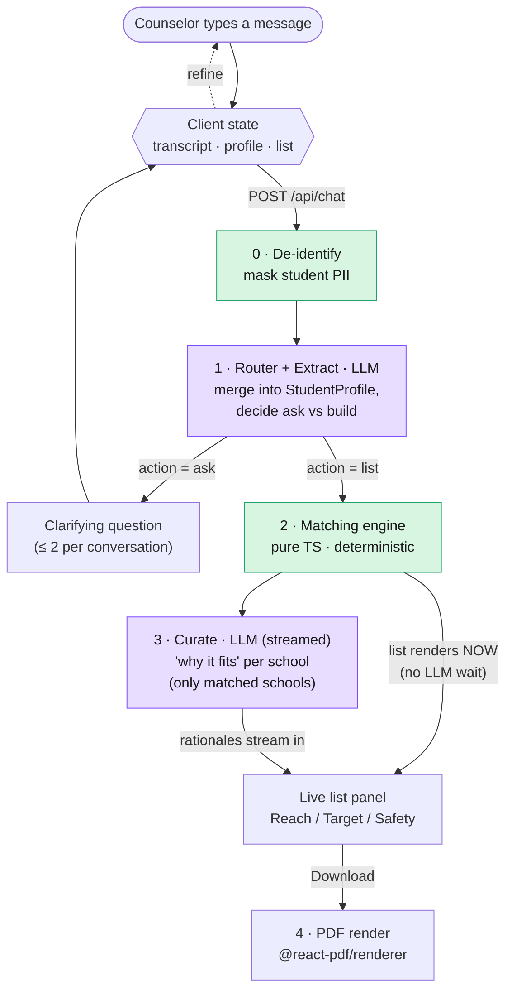
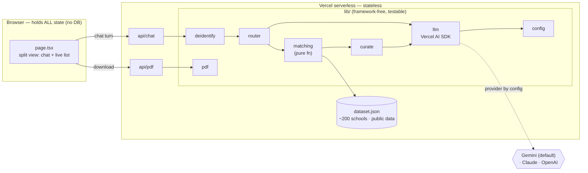

# College List Builder — Architecture

Three diagrams, each answering one question about how the system works. Full rationale
lives in [the design spec](design/2026-07-24-college-list-builder-design.md).

---

## 1. What happens when a counselor sends a message? (request flow + refine loop)

The app is a **conversation**, not a one-shot form. Each message runs a stateless
server pipeline; the browser holds the state and the list refines in place.

**Notes:** the LLM does the two things it's good at — reading messy prose into
structured data (router) and writing tailored prose (curate). The two steps that must be
*defensible* — which schools, which tier — are **pure deterministic code** (green) over
real data, so nothing is hallucinated. Because that step is instant, the list **renders
before curate runs** and the rationales stream in after — fast *and* correct.

---

## 2. How is the code organized? (components + dependencies)

One Next.js app on Vercel. All logic sits in framework-free `lib/` modules that thin API
routes call — which is why it's portable to Express and needs no separate backend.

**Notes:** the LLM provider is a **config value** (`LLM_PROVIDER`/`LLM_MODEL`),
so switching Gemini→Claude is one env var. Deliberately *absent*: MongoDB, Redis, S3,
Express — a stateless prompt→list→PDF function doesn't need them.

---

## 3. How do we protect the student's identity? (privacy data-path)

The sensitive value (real name) and the useful value (a list) travel on **separate
paths** that only rejoin in the browser, at PDF render. The name is structurally unable
to reach the model.

> The message is de-identified at the **route edge**: only masked text (`«STUDENT»`)
> flows to the LLM/logs, while the extracted real name is sent straight back to the
> browser for the PDF header. **Precise guarantee: the name never reaches the LLM or
> logs.** The edge transiently handles it *in order to mask it* — that's what makes
> masking possible; we don't overstate it as "never touches the server".

**Notes:** privacy-by-architecture, not by policy — real student PII stays out
of the model and logs even if a counselor pastes a real name.

---

## Key decisions at a glance

| Decision | Choice | Why |
|---|---|---|
| Generation engine | Extract → match dataset → LLM curate | Real data, not guesswork; no hallucinated schools |
| List structure | Reach / Target / Safety, ~10 schools | Standard counselor framing; "set clear expectations" |
| Interaction | Chat-style refine loop (split view) | Counseling is iterative, not one-and-done |
| LLM layer | Model-agnostic, **default Gemini** | Free tier → $0; provider is a one-line config swap |
| Privacy | De-identify before LLM | Keeps real student PII out of the model and logs |
| Vector search | Stretch (build-time embeddings + cosine) | Semantic program match; core works without it |
| Excluded infra | No Mongo/Redis/S3/Express | Stateless function; adding them = cargo-culting |
| Host | Vercel | Free; zero-config for Next.js; one `git push` |
