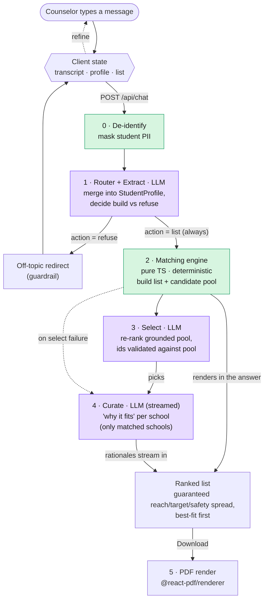
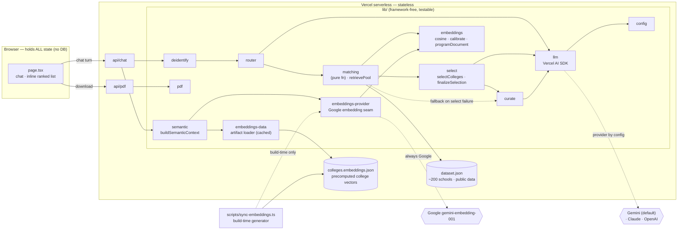
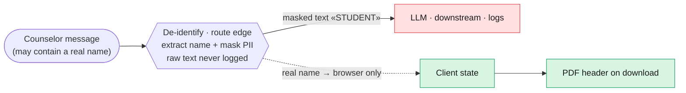

# College List Builder — Architecture

Three diagrams, each answering one question about how the system works. Full rationale
lives in [the design spec](design/2026-07-24-college-list-builder-design.md).

---

## 1. What happens when a counselor sends a message? (request flow + refine loop)

The app is a **conversation**, not a one-shot form. Each message runs a stateless
server pipeline; the browser holds the state and the list refines in place.

**Notes:** the LLM does three things it's good at — reading messy prose into
structured data (router), re-ranking a grounded candidate pool with knowledge the
dataset doesn't carry like co-op and hands-on learning (select), and writing tailored
prose (curate). Selection can never invent a school: the model returns ids, and only
ids present in the pool survive (`finalizeSelection`); any select failure falls back to
the deterministic list the matching engine already built. Before building the list, the
route embeds the student's interests (`gemini-embedding-001`, 256-dim) and loads the
committed college vectors; on any failure it falls back to keyword-only, logged as a
step.

---

## 2. How is the code organized? (components + dependencies)

One Next.js app on Vercel. All logic sits in framework-free `lib/` modules that thin API
routes call — which is why it's portable to Express and needs no separate backend.

**Notes:** the LLM provider is a **config value** (`LLM_PROVIDER`/`LLM_MODEL`),
so switching Gemini→Claude is one env var. Embeddings are a separate, always-Google
seam (`gemini-embedding-001`) — `sync-embeddings.ts` precomputes college vectors at
build time into the committed `colleges.embeddings.json`, so the runtime only ever
calls the embedding API for the student's interests, and that call fails soft to
keyword-only. Deliberately *absent*: MongoDB, Redis, S3, Express, and a vector
database — a stateless prompt→list→PDF function doesn't need them, and ~1,500 ×
256-dim in-memory cosine is too small to warrant one.

---

## 3. How do we protect the student's identity? (privacy data-path)

The sensitive value (real name) and the useful value (a list) travel on **separate
paths** that only rejoin in the browser, at PDF render. The name is structurally unable
to reach the model.

> The message is de-identified at the **route edge**: only masked text (`«STUDENT»`)
> flows to the LLM/logs, while the extracted real name is sent straight back to the
> browser for the PDF header. **Precise guarantee: the name never reaches the LLM or
> logs.** The edge transiently handles it *in order to mask it* — that's what makes
> masking possible; we don't overstate it as "never touches the server".

**Notes:** privacy-by-architecture, not by policy — real student PII stays out
of the model and logs even if a counselor pastes a real name.

---

## Key decisions at a glance

| Decision | Choice | Why |
|---|---|---|
| Generation engine | Extract → match dataset (deterministic) → LLM select (grounded) → LLM curate | Real data, not guesswork; no hallucinated schools |
| Grounded LLM selection | Model re-ranks a real candidate pool of dataset ids | Applies reputational knowledge (co-op, hands-on) the dataset lacks; ids validated against the pool so no invented schools; any failure falls back to the deterministic list |
| List structure | Single list, ~12 schools, ordered best-fit-first | Fit (not just admission odds) decides ordering; no arbitrary tier cutoffs |
| Selectivity spread over admit-chance sort | Bucket by admit chance into reach (<0.30) / target / safety (≥0.75); each bucket contributes its best-fit schools to a guaranteed 3/5/4 spread, backfilled to a full list | Guarantees a reach/target/safety mix instead of the twelve highest admit rates; geography is a heavily-weighted soft signal, not a hard filter; the chat reply never enumerates colleges — the cards are the list |
| Interaction | Chat-style refine loop; answers render inline | Iterative counseling; always answers, never a clarifying dead-end |
| LLM layer | Model-agnostic, **default Gemini** | Free tier → $0; provider is a one-line config swap |
| Privacy | De-identify before LLM | Keeps real student PII out of the model and logs |
| Semantic matching | Augments program-fit only | Embeddings only feed `programComponent` inside `fitScore`; admit-chance, prestige, and bucket selection stay deterministic |
| College vectors | Precomputed + committed | Runtime needs no key for the college side; results are reproducible |
| Vector storage | No vector DB | ~1,500 × 256-dim in-memory cosine is trivial; an index/DB is unwarranted |
| Excluded infra | No Mongo/Redis/S3/Express | Stateless function; adding them = cargo-culting |
| Host | Vercel | Free; zero-config for Next.js; one `git push` |
